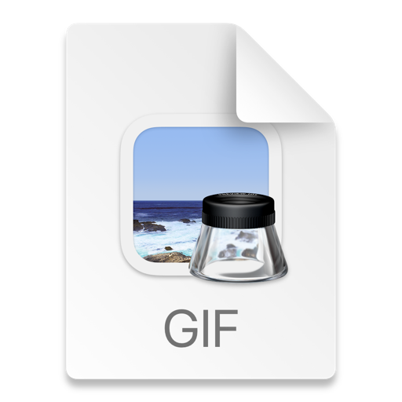

# Coinage - Real-time Cryptocurrency Price Tracker

*   Real-time Price Updates: Displays live cryptocurrency prices fetched via WebSocket.
*   Jetpack Compose UI: Modern and declarative UI.
*   MVVM Architecture: Clean separation of concerns for maintainability.
*   StateFlow: Efficiently manages and updates UI state.
*   Room Database: Local caching for offline access.
*   Dependency Injection: Uses Hilt for dependency injection.

# Libraries Used

*   Kotlin Coroutines and Flow
*   Jetpack Compose
*   Hilt
*   Retrofit
*   OkHttp
*   Room
*   Gson
# screenshot 

## screen recording
* Size more that 30 mb
